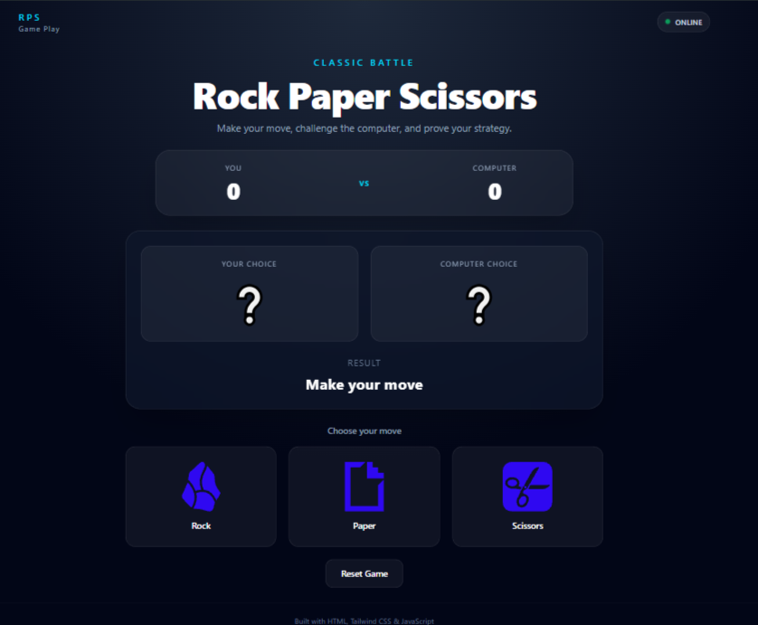

# ✊ Rock Paper Scissors

A modern and responsive Rock Paper Scissors game built with **JavaScript**, **Tailwind CSS**, and **Vite**.

## 📸 Preview



## 🚀 Live Demo

🔗 **[View Live Demo](https://ehsanellahi1385-commits.github.io/Rock-Paper-scissors/)**

## ✨ Features

- 🎮 Interactive Rock Paper Scissors gameplay
- 🤖 Random computer opponent
- 🏆 Live score tracking
- ⚡ Round result animation
- 🔄 Reset game functionality
- 📱 Fully responsive design
- 🎨 Modern dark UI

## 🛠️ Built With

- HTML
- Tailwind CSS
- JavaScript
- Vite

## 📂 Project Structure

```text
rock-paper-scissors/
├── src/
│   ├── assets/
│   ├── main.js
│   └── style.css
├── index.html
├── package.json
└── vite.config.js
```
